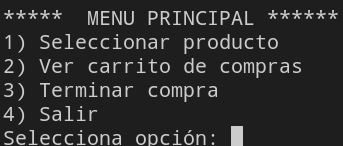
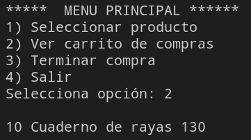
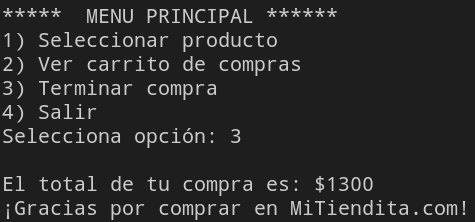

# Proyecto Integrador

La pandemia de Covid-19 generó un fuerte retroceso económico en casi todo el mundo, con la peor caída del PIB a nivel global, al menos desde la Segunda Guerra Mundial. En este 2021 se está haciendo frente a esa fuerte caída con medidas para tratar de reactivar la economía y el consumo.

La ***\*Asociación Mexicana de Venta Online (AMVO)\****, que representa a proveedores de servicios para el comercio electrónico, agencias de consultoría y marketing digital y tiendas minoristas en línea (grandes y pequeñas, nativas o tradicionales con canal digital), tiene claro que la pandemia aumentó la relevancia de las ventas digitales en la estrategia de negocio y calcula que “2 de cada 10 (marcas y comercios) han experimentado crecimientos mayores al 300%”. En 2021, pronostica, para 2 de cada 10 compañías [el comercio electrónico representará 30% de sus ventas totales](https://www.amvo.org.mx/estudios/reporte-4-0-impacto-covid-19-en-venta-online-mexico/).

*Utilizando el paradigma orientado a objetos, en este proyecto integrador propondrás soluciones creativas que modelen algunas de las necesidades del manejo de información requerido en las transacciones de comercio electrónico*

### Fuentes de información:

[La pandemia dispara el comercio electrónico](https://www.elfinanciero.com.mx/bloomberg-businessweek/la-pandemia-dispara-el-comercio-electronico/)

[La pandemia cambió el comercio electrónico para siempre](https://www.eleconomista.com.mx/opinion/La-pandemia-cambio-el-comercio-electronico-para-siempre-20201109-0057.html)

------

El proyecto integrador consiste en crear una aplicación orientada a objetos que permita la operación de una tienda virtual.

Cada una de las clases deberá tener su propio archivo **.cpp** y su .**h**

Deberá existir un archivo **main.cpp** que será el <u>**orquestador**</u> de la aplicación.

#### Deberá de realizarse el diagrama UML completo de toda la aplicación, será guardado como imagen en el folder del repositorio.

------

El inventario inicial estará en un archivo inventario.csv con la siguiente información:

| Identificador | Descripción       | Precio Venta | Unidades en Stock |
| ------------- | ----------------- | ------------ | ----------------- |
| ID0001        | Agua Embotellada  | 15.54        | 25                |
| ID0002        | Bote de Palomitas | 25.65        | 125               |
| ID0003        | ICE de cereza     | 40.23        | 50                |

Este archivo tendrá que ser leido para tener un catalogo de productos para vender en su tienda virtual.

Este es un ejemplo de como correría su aplicación, NO quiere decir que así debe de correr su apliación.

Si seleccionamos la opción 1:

#### Si ya no hay stock de ese producto lo debe de indicar.

Cuando escojamos  la opción 2:

cuando escojamos la opcion 3 :

Al seleccionar la opción 4 debe de terminar el programa.

